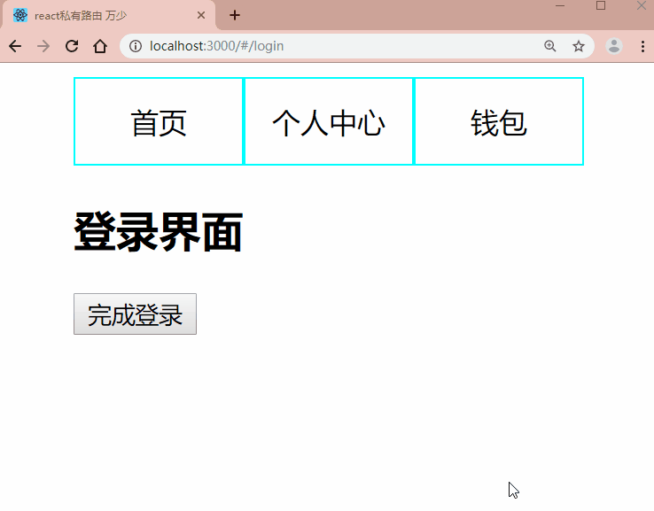

# react-路由 实现私有路由

## 效果




## 业务讲解

1. 一个三个页面
2. `首页` 为公开页面
3. `个人中心` , `钱包` 为私有页面
4. 通过`context` 管理全局用户凭据 `token`
5. 通过 `history.relace` 实现成功登录后跳转


## 代码

```jsx
import React, { Component, Fragment } from 'react';
import { HashRouter as Router, NavLink, Route, Redirect, Switch } from "react-router-dom";
import "./App.css";

// react内置的全局数据管理 => 可以将其理解为redux
const MyContext = React.createContext();
const { Provider } = MyContext;

// 首页
const Home = () => <div>首页</div>
// 个人中心
const User = () => <div>个人中心</div>
// 钱包
const Wallet = () => <div>钱包</div>
// 提示信息
const Info = () => <div>你没有登录</div>


// 封装私有路由 根据 token 判断是否已经登录
class PrivateRoute extends Component {
  static contextType = MyContext;
  renderNormal = () => {
    return <Route {...this.props} />
  }

  renderLogin = () => {
    // state用来记录从哪个页面跳转到 登录 方便登录成功会重新跳转
    return <Redirect to={{ pathname: "/login", state: this.props.path }}></Redirect>
  }

  render() {
    if (this.context.token) {
      return this.renderNormal();
    } else {
      return this.renderLogin();
    }
  }
}


// 登录页面
class Login extends Component {
  static contextType = MyContext;
  onClick = () => {
    this.context.changeToken(true);
    const { history, location } = this.props;
    history.replace(location.state);
  }
  render() {
    return (
      <div>
        <h2>登录界面</h2>
        <Info></Info>
        <hr/>
        <button onClick={this.onClick} >完成登录</button>
      </div>
    );
  }
}


class App extends Component {
  state = {
    token: false
  }
  changeToken = (token) => {
    this.setState({ token });
  }
  render() {
    return (
      <div className="app">
        <Provider value={{ token: this.state.token, changeToken: this.changeToken }}>
          <Router>
            <nav>
              <NavLink exact to="/" >首页</NavLink>
              <NavLink exact to="/user" >个人中心</NavLink>
              <NavLink exact to="/wallet" >钱包</NavLink>
            </nav>
            <section>
              <Switch>
                <Route path="/" exact component={Home} />
                <Route path="/info" exact component={Info} />
                <Route path="/login" exact component={Login} />
                <PrivateRoute path="/user" exact component={User} />
                <PrivateRoute path="/wallet" exact component={Wallet} />
              </Switch>
            </section>
          </Router>
        </Provider>
      </div>
    );
  }
}
export default App;
```

